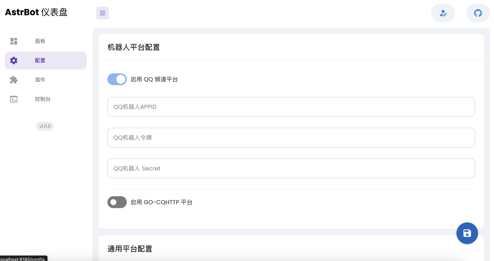
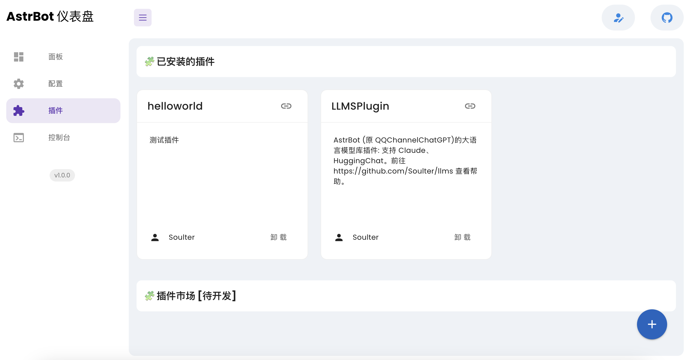

:::info

在部署完后，打开 [http://localhost:6185](http://localhost:6185) 或者 `http://<公网ip>:6185` 即可看到本可视化面板页面。默认登录密码都为空。

可视化面板目前只实现了基本功能，会慢慢完善功能。
**可视化面板将会独立成为一个新的项目供其他机器人项目免费使用。**
:::

## 数据统计

可以查看机器人上行消息量、消息总数、会话总数等。

## 配置管理

可以可视化修改配置。当聚焦在某一个配置上时，会弹出配置描述。

:::caution

注意修改完之后点击右下角的保存按钮！点击之后，机器人会重启以生效新配置。

:::

## 插件管理

支持安装、卸载插件。点击右下角的按钮来安装插件。

## 修改密码

点击左上角的倒数第二个按钮。默认原密码为空。

## 修改面板用户名

在配置页面中的底部。注意填写完毕之后点击保存按钮。