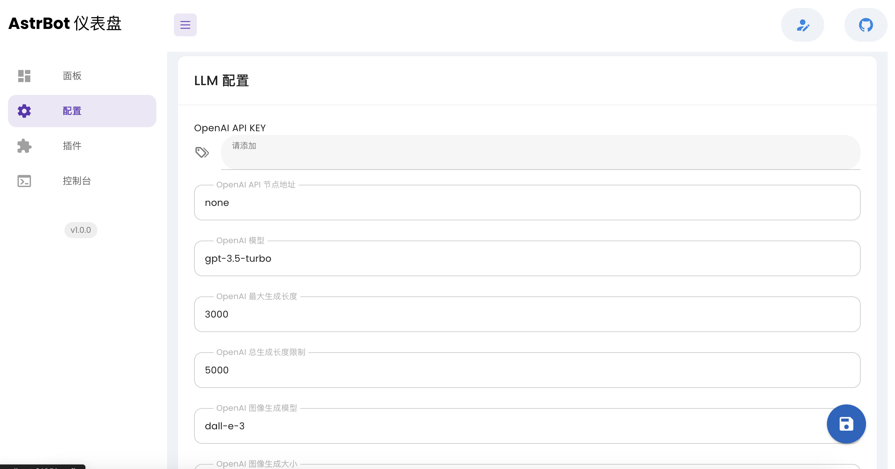
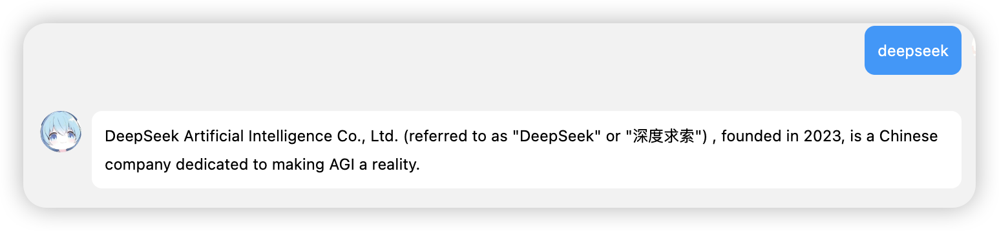

:::info

AstrBot 集成了大语言模型的一些功能。

:::

## 🌍支持的AI语言模型一览：
- OpenAI 各类模型（需自行申请API Key 或者第三方服务）
- 任何与 OpenAI Chat API 接口一致的语言模型服务，如 Deepseek、文心一言等
- Gemini (免费，[LLMs插件](https://github.com/Soulter/llms)支持）
- Claude（免费，由[LLMs插件](https://github.com/Soulter/llms)支持）（不稳定）
- HuggingChat（免费，由[LLMs插件](https://github.com/Soulter/llms)支持）（不稳定）

:::tip
如果你正在寻求低价且稳定的 LLM 服务来跑通 AstrBot，可以考虑：

- 使用 [Deepseek](https://deepseek.com)，默认赠送 500万 的 Token，可以支持使用很长一段时间。并且价格在 1~2元 每 100万 Token。API 兼容 OpenAI API。
:::

## OpenAI API

:::info
本接入方式不仅支持 OpenAI 官方的模型，亦支持与 OpenAI Chat API 接口一致的第三方语言模型服务。如国内的众多 OpenAI 中转服务、文心一言、Deepseek等。或者是自己搭建的 OpenAI 接口服务，如 One-API。

One-API 基本支持现今全球所有厂商的模型，其将这些模型统一成了 OpenAI 的接口风格。

有关 One-API 的搭建请参考 [接入One-API](/docs/advanced/one-api)。
:::

如果您有 OpenAI API Key，可以直接在 `可视化面板-配置` 页面中添加。如果你用的是与 OpenAI Chat API 接口一致的模型服务，请填完 key 之后，修改 `api base` 项。如何填写 `api base` 请参考你的第三方服务的文档。

> 某些第三方服务可能模型名称，AstrBot 默认使用的模型是 `gpt-4o` 可能这些第三方服务不支持。请记得在下面也修改一下模型名称为你的模型服务支持的模型名。

### 使用 Deepseek 快速接入测试

前往 [Deepseek](https://deepseek.com) 注册账号，然后在 `API Keys` 页面中创建一个新的 API Key，复制下来。前往 AstrBot可视化面板，修改如下配置：

- OpenAI API Key: `你在 Deepseek 上创建的 API Key`
- OpenAI 节点地址：`https://api.deepseek.com`
- OpenAI 模型名称：`deepseek-chat`

然后保存，即可。

:::caution
最新信息以 https://platform.deepseek.com/api-docs/zh-cn/ 官方文档为准。
:::

### 使用 GPT_API_free 快速接入测试

如果你还没有任何可用的模型服务，你可以尝试一下使用如下项目来获得一个免费的 OpenAI API Key。
 
https://github.com/chatanywhere/GPT_API_free 

打开这个链接，然后点击**申请免费内测**，就可以得到一个免费的第三方key，把它复制下来。

然后，修改 `OpenAI API 节点地址` 为以下任意一个：
- https://api.chatanywhere.tech （国内低延时）
- https://api.chatanywhere.cn (国外使用,国内需要全局代理)

记住修改完之后点击右下角的保存按钮。

有经济能力可支持 https://github.com/chatanywhere/GPT_API_free 购买低价key，获得更多模型。

在保存并且 AstrBot 重启成功后，你可以在任何一个支持聊天的地方与其对话来测试是否接入成功。

### 使用自部署的 Ollama 接入

[Ollama](https://ollama.com) 是一个用来运行 LLM 的工具，用于简化在本地运行大语言模型，降低大语言模型使用门槛。它支持部署众多开源 LLM，如 Llama3、Qwen2、Phi3、Gemma2 等。

Ollama 部分兼容 OpenAI API，因此可以很方便地将部分能力接入到 AstrBot。

:::tip
Ollama 官网提到其对 OpenAI 的兼容性是实验性的，可能会有重大调整。因此在未来的版本中，AstrBot 将会直接支持 Ollama 的 Python 库以充分发挥其能力。
:::

要应用 Ollama，你需要先在本机部署 Ollama。部署方式非常简单，先前往[官方页面](https://ollama.com)下载 Ollama，待安装完成后，打开终端输入 `ollama run <你想运行的LLM>` 即可。支持的 LLM 请在其官网搜索。

:::tip
请留意你的机器配置是否能运行你想运行的模型。如果你仅想在花费最少的性能下快速部署，可以尝试小模型 `phi`，它是由 Microsoft Research 开发的具有 27 亿个参数的 SLM。仅 1.7 GB 大小。你可以输入 `ollama run phi` 运行。
:::

在下载模型成功后，会自动开放 `11434` 端口。你可以浏览器打开 `http://localhost:11434` 查看是否正常运行。正常情况下，会提示 `ollama is running`。

然后修改 AstrBot 中的：

- OpenAI API Key: `ollama`
- OpenAI 节点地址：`http://localhost:11434/v1`
- OpenAI 模型名称：`<你部署的模型名，如 llama3>`

:::caution
如果你是在公网服务器上运行的 Ollama，并且 AstrBot 与 Ollama 不运行在同一台机器下，可以将 `localhost` 更改为你的公网地址。如果是国内的云厂商，可能还需开放 11434 端口。若开放，请留意接口不被黑客滥用。
:::

## LLMS 插件

LLMS 插件支持接入 Gemini、HuggingChat 等服务。详见 [LLMS 插件](https://github.com/soulter/llms)。