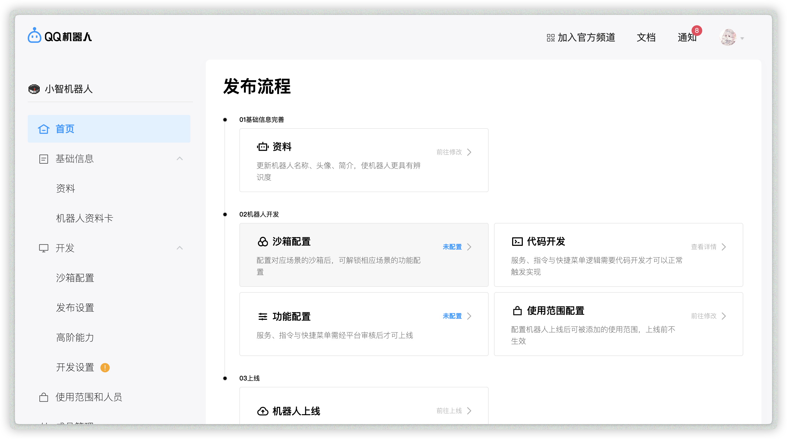

此页将帮助您把机器人程序接入到消息平台（QQ/QQ频道/Telegrqm/...）上。

## Nakuru, AIOCQhttp 和 QQ官方机器人接口

- `nakuru` 和 `aiocqhttp` 是 AstrBot 中使用的对 OneBot 协议的支持库。更推荐使用 `aiocqhttp`，其适合连接到支持反向 Websocket 的 OneBot 协议实现，如 `go-cqhttp`, `Napcat`, `Lagrange`, `Shamrock` 等。

> 更推荐使用 aiocqhttp 来接入。

- `QQ 官方机器人接口` 是腾讯QQ团队开源的QQ频道消息接口。官方认证，因此很稳定。不过需要申请 appid、secret。并且对主动消息有限值。

## aiocqhttp(推荐)

目前仅支持反向 WebSocket。

有关如何在 NapCat/Lagrange.OneBot/go-cqhttp/shamrock 中配置反向 Websocket 的 host 和 port，请查阅其官方网站。

- NapCat: [点击查看](https://napneko.github.io/zh-CN/guide/getting-started)
- Lagrange.OneBot: [点击查看](https://lagrangedev.github.io/Lagrange.Doc/Lagrange.OneBot/Config/#%E9%85%8D%E7%BD%AE%E6%96%87%E4%BB%B6)
- Shamrock: [点击查看](https://whitechi73.github.io/OpenShamrock/guide/configuration.html#%E9%85%8D%E7%BD%AE%E6%96%87%E4%BB%B6)
- go-cqhttp: [点击查看](https://docs.go-cqhttp.org/guide/config.html#%E9%85%8D%E7%BD%AE%E4%BF%A1%E6%81%AF)

> 如果您之前没运行过相关的项目，我们建议您选用 Napcat、Lagrange.OneBot、LLoneBot 等基于 QQNT 的项目，成功率较高。

1. 在各协议实现中配置好反向 Websocket 的 host 和 port。host 如 `127.0.0.1`，port 如 `6199`。
2. 在协议实现端启用反向 Websocket。连接到 `ws://host:port/ws`。（请特别注意是 `/ws` 路由！）
3. 打开`可视化面板->配置页->QQ(aiocqhttp)`，点击右边的 `配置` 按钮，在下方出现的配置项中填写好 host 和 port，并启用。
  > 注意：如果您正在使用 Docker 部署 AstrBot，您需要暴露对应的端口，并且 host 建议填写 `0.0.0.0`
1. 点击右下角的保存按钮。

:::warning
请注意，如果您使用的是 go-cqhttp，请将其配置文件下 `message.post_format` 设置为 `array`（默认是 string）。否则您将得到一个警告回复，并且无法正常使用。
:::

查看控制台，如果出现: 

```
|MainThread|astrbot.load_platforms|manager.py:27 - 启用 QQ(aiocqhttp 适配器)
[2024-07-26 05:38:07 -0400] [2673620] [INFO] Running on http://0.0.0.0:6199 (CTRL + C to quit)
[2024-07-26 05:38:09 -0400] [2673620] [INFO] 172.17.0.5:33962 GET /ws 1.1 101 - 585
```

说明成功部署。

## nakuru

:::CAUTION
更推荐使用上面的 aiocqhttp，支持的功能更全，文档更多。
:::

> 支持接入 go-cqhttp 以部署到 qq、qq频道

:::CAUTION
由于QQ严查第三方 QQ 协议客户端，如果您使用的是 cq-http 或者 mirai，你可能会被提示登录失败（code 45/237/238）。
:::

### Windows 启动器部署
修改好 launcher 同目录下的 config.yml 中的 QQ 号和 QQ 密码后，运行 launcher 同目录下的 go-cqhttp 程序（会释出一个bat文件，之后运行这个释出的文件即可）。

> 或者，您可以自行搭建其他**支持 OneBot 协议**的机器人框架，包括但不限于 mirai、shamrock，这里给出shamrock的仓库：https://github.com/whitechi73/OpenShamrock

### 非 Windows 启动器部署
如果您希望使用 cq-http，需要自行新开窗口（tmux/screen）部署[cqhttp](https://github.com/Mrs4s/go-cqhttp/releases/latest)，并且将gocqhttp的配置文件的server部分替换为以下文本:
```
servers:
  - http:
      host: 127.0.0.1
      version: 0
      port: 5700
      timeout: 5
  - ws:
      address: 127.0.0.1:6700
      middlewares:
        <<: *default
```

### 使用 go-cqhttp 登录失败？
如果登录失败，请尝试以下方案：

1. device.json 的 protocol 字段的 6 改成 2，重启 go-cqhttp。
2. 删除 device.json 并换一个 QQ 号。
3. 签名服务器

如果部署成功，那么你可以在可视化面板-配置页中找到并打开 OneBot 配置页，启用这个平台。（对于老版本的 AstrBot，显示的是 go-cqhttp）。记得右下角保存。

## QQ官方机器人接口

### 申请一个机器人

> 您可能需要注意以下几点：
> 1. QQ官方机器人目前对外开放QQ频道、QQ群、QQ私聊。但是QQ群和QQ私聊能力需要审核，审核需要花费时间。
> 2. 分为公域和私域机器人。前者支持任何人拉机器人到自己的频道，后者仅支持自己设置频道白名单。默认为私域。
> 3. 如果您的**现在的**（也就是说，加入机器人之后，就没有这个人数限制）频道/QQ群人数小于20人，那么可以很方便地将机器人拉入您的频道/群，只需要在q.qq.com设置沙箱频道/群即可。
> 4. 如果您想将机器人拉入>=20人的频道，那么您必须在q.qq.com上线机器人，这需要写提审报告等等，教程请参见q.qq.com上的官方教程。需要注意的是，在提审过程中，请务必确保不启用LLM能力（或者隐藏起来——在可视化面板-配置项中填写 LLM唤醒词。），否则可能审核失败。


首先，打开 [QQ官方机器人](https://q.qq.com) 并登录。

然后，点击创建机器人，填写名称、简介、头像等信息。然后点击下一步、提交审核。等待安全校验通过后，创建成功。

点击创建好的机器人，然后你将会被导航到机器人的管理页面。如下图所示：



我们点击沙箱配置，这允许你立即设置一个沙箱频道/群/私聊，用于拉入机器人（需要小于等于20个人）。

然后你将会看到 QQ 群配置、消息列表配置和 QQ 频道配置。根据你的需求来选择QQ群、允许私聊的QQ号、QQ频道。

显示添加成功后，前往对应的地方，拉入机器人。
- QQ群：点击群右上角，往下滑找到群机器人，点击，往下滑，在`其他`一栏找到机器人，点击添加即可。
- 消息列表：点击`添加成员`的左侧的二维码按钮，扫码即可。
- QQ频道：点击频道右上角，点击`机器人`，往下滑，找到机器人，点击添加即可。

添加机器人到你想用的地方后，点击`开发->开发设置`，找到 appid、secret。复制。

打开机器人可视化面板，点击 `配置` 页的 `QQ官方` 配置项，启用，并填写 appid、secret 即可。记得右下角保存。

## Telegram

AstrBot并不原生支持 Telegram，但是您可以插件的形式启用此能力。

在可视化面板-插件页右下角添加插件，url填写：https://github.com/Soulter/astrbot_plugin_telegram 。

安装完毕之后，打开此插件的配置，进行相关配置即可。

telegram的token申请请自行谷歌，很方便。

> 对此插件的问题请提交issue至 https://github.com/Soulter/astrbot_plugin_telegram/issues 。不要提交到 AstrBot。
