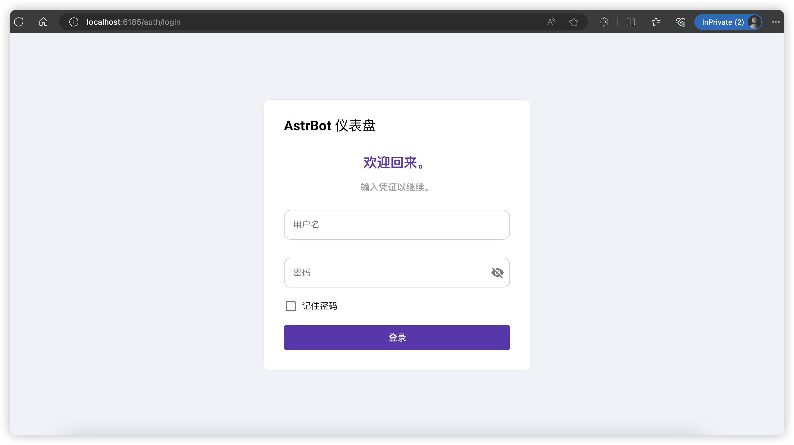

:::caution

请保证你的 OS 的 Python 版本 Python 版本 >= 3.9。或者可以采用更简单的部署方式，详见：[通过 Docker 部署](通过Docker部署)

:::


## 下载项目
```bash
git clone https://github.com/Soulter/AstrBot.git
cd AstrBot
```

## 运行项目

```bash
python3 main.py
```

成功运行之后，控制台日志输出如下：

```log
2024-07-27 09:09:32.632| INFO     |MainThread|astrbot.<module>|main.py:54 - 
     ___           _______.___________..______      .______     ______   .___________.
    /   \         /       |           ||   _  \     |   _  \   /  __  \  |           |
   /  ^  \       |   (----`---|  |----`|  |_)  |    |  |_)  | |  |  |  | `---|  |----`
  /  /_\  \       \   \       |  |     |      /     |   _  <  |  |  |  |     |  |     
 /  _____  \  .----)   |      |  |     |  |\  \----.|  |_)  | |  `--'  |     |  |     
/__/     \__\ |_______/       |__|     | _| `._____||______/   \______/      |__|     
                                                                                    
 
 2024-07-27 09:09:32.693| INFO     |MainThread|astrbot.__init__|bootstrap.py:32 - AstrBot v3.3.0 
 2024-07-27 09:09:32.693| INFO     |MainThread|astrbot.__init__|bootstrap.py:47 - 未使用代理。 
 2024-07-27 09:09:32.693| INFO     |MainThread|astrbot.register|manager.py:56 - 已注册指令 help。 
 2024-07-27 09:09:32.694| INFO     |MainThread|astrbot.register|manager.py:56 - 已注册指令 wake。 
 2024-07-27 09:09:32.694| INFO     |MainThread|astrbot.register|manager.py:56 - 已注册指令 update。 
 2024-07-27 09:09:32.694| INFO     |MainThread|astrbot.register|manager.py:56 - 已注册指令 plugin。 
 2024-07-27 09:09:32.694| INFO     |MainThread|astrbot.register|manager.py:56 - 已注册指令 reboot。 
 2024-07-27 09:09:32.694| INFO     |MainThread|astrbot.register|manager.py:56 - 已注册指令 websearch。 
 2024-07-27 09:09:32.694| INFO     |MainThread|astrbot.register|manager.py:56 - 已注册指令 t2i。 
 2024-07-27 09:09:32.694| INFO     |MainThread|astrbot.register|manager.py:56 - 已注册指令 myid。 
 2024-07-27 09:09:32.707| INFO     |MainThread|astrbot.plugin_reload|manager.py:177 - 插件 helloworld(Soulter) 加载成功。 
 2024-07-27 09:09:32.707| INFO     |MainThread|astrbot.register|manager.py:54 - 已注册 Soulter/helloworld 的指令 helloworld。 
 2024-07-27 09:09:32.707| WARNING  |MainThread|astrbot.load_platform|bootstrap.py:112 - 未启用任何消息平台。 
 2024-07-27 09:09:32.708| INFO     |MainThread|astrbot.run_http_server|server.py:505 - HTTP 服务器已启动，可访问: http://198.18.0.1:6185 等来登录可视化面板。 
 2024-07-27 09:09:32.722| INFO     |MainThread|astrbot.ws_server|server.py:493 - WebSocket 服务器已启动。
```

这时，可以打开日志中的URL，即可登录本项目的可视化面板。如果提示需要登录，请直接点击登录按钮。密码和用户名可在之后修改。密码使用 MD5 加密，并且只存于本地。

对于这个面板的使用，详见：[可视化面板的使用](/使用/可视化面板)




至此，部署完毕。

## 如何放到后台运行？

可以使用 `nohup` 指令。

推荐使用 `tmux` 工具。[Linux tmux 終端機管理工具使用教學](https://blog.gtwang.org/linux/linux-tmux-terminal-multiplexer-tutorial/)

要在消息平台上使用，请看 [平台配置](/配置/平台配置)
