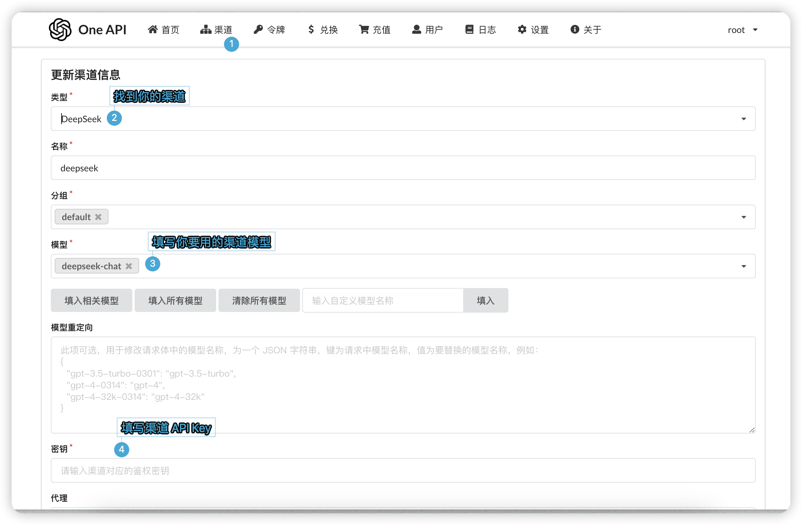

OneAPI 使得我们能通过标准的 OpenAI API 格式访问全球几乎所有厂商的所有大模型，并且做到了开箱即用。

```
 OpenAI ChatGPT 系列模型（支持 Azure OpenAI API）
 Anthropic Claude 系列模型 (支持 AWS Claude)
 Google PaLM2/Gemini 系列模型
 Mistral 系列模型
 字节跳动豆包大模型
 百度文心一言系列模型
 阿里通义千问系列模型
 讯飞星火认知大模型
 智谱 ChatGLM 系列模型
 360 智脑
 腾讯混元大模型
 Moonshot AI
 百川大模型
 MINIMAX
 Groq
 Ollama
 零一万物
 阶跃星辰
 Coze
 Cohere
 DeepSeek
 Cloudflare Workers AI
 DeepL
 together.ai
 novita.ai
```

它是一个开源项目，你可以在 [这里](https://github.com/songquanpeng/one-api) 找到它。

## 部署 OneAPI

请参阅 [OneAPI 部署文档](https://github.com/songquanpeng/one-api?tab=readme-ov-file#%E9%83%A8%E7%BD%B2)。

:::tip
使用 Docker 部署非常方便。
:::

在部署完之后，打开 OneAPI 后台面板（如果你没改端口，端口默认是 3000），使用默认账户`root` 密码 `123456` 登录管理员账号。

然后，点击渠道，添加相关信息。



:::tip
如果对应的渠道需要代理，请在下面添加代理。
:::

添加成功后，点击 `令牌`，添加一个令牌。模型范围需要选择刚刚添加的渠道。

添加成功后，再次点击 `令牌`，点击 `复制`。如果复制失败，请手动复制。

:::tip
请关注你创建好的令牌的剩余额度。
:::

接着，打开 AstrBot 可视化面板，点击 `配置` 页，找到 `OpenAI API Key`，填写刚刚复制的令牌。

然后，修改 `OpenAI API Base` 为你的 OneAPI 后端地址，如 `http://localhost:3000/v1`。如果你在公网上部署了 OneAPI，那么请填写你的公网地址。如 `http://example.com:3000/v1`。