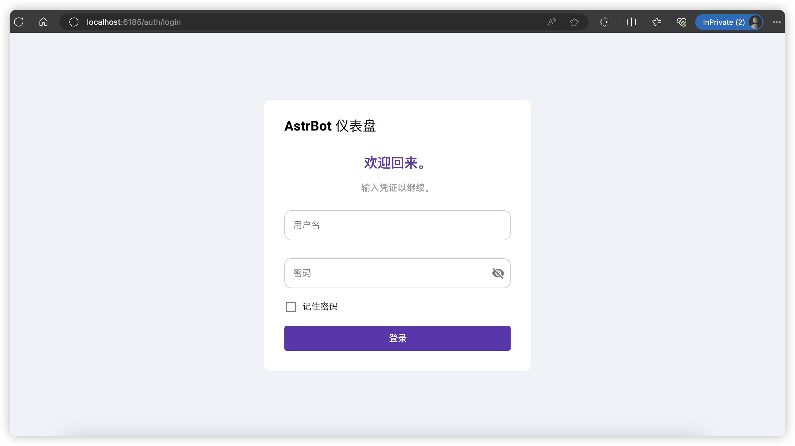

:::caution

Docker 镜像尚处开发阶段，难免有 bug。在发现 bug 之后，可以提交 issue。

:::

只需执行：

```bash
docker run -itd -p 6185:6185 soulter/astrbot:latest
```

如果报 docker: command not found 的话，说明你还没有安装 docker，请先安装。

成功运行之后，请打开 `http://localhost:6185` （如果你的服务器有公网 ip，也可以打开 `http://[你的服务器公网 IP]:6185`，如果打不开，请检查 Linux 防火墙和服务器托管商处是否放行了 6185 端口）

打开之后即可看到本项目的可视化面板。如果提示需要登录，请直接点击登录按钮。密码和用户名可在之后修改。密码使用 MD5 加密，并且只存于本地。

对于这个面板的使用，详见：[可视化面板的使用](../使用/可视化面板)



:::caution

**告知老用户**：这是最近新加入的功能，在以后的版本中，AstrBot 将弃用 `configs/config.yaml` 配置文件，会将其中的内容全部转移至 `cmd_config.json` 下，以避免 Git 冲突的发生。

:::

至此，部署完毕。

要在消息平台上使用，请看 [平台配置](/配置/平台配置)
